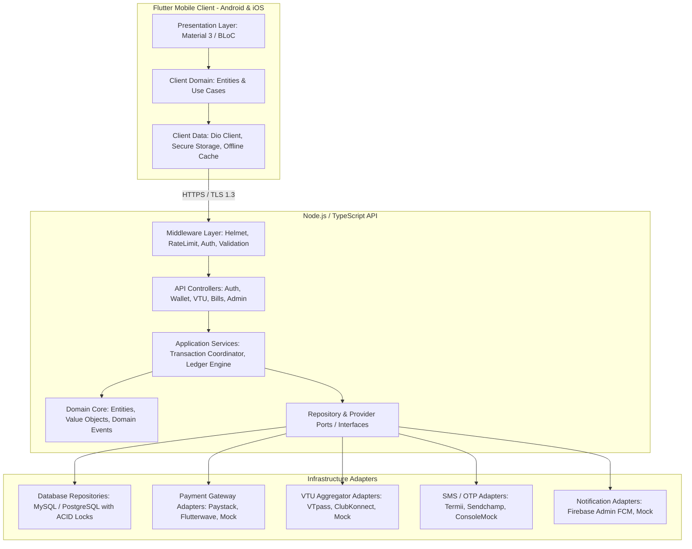
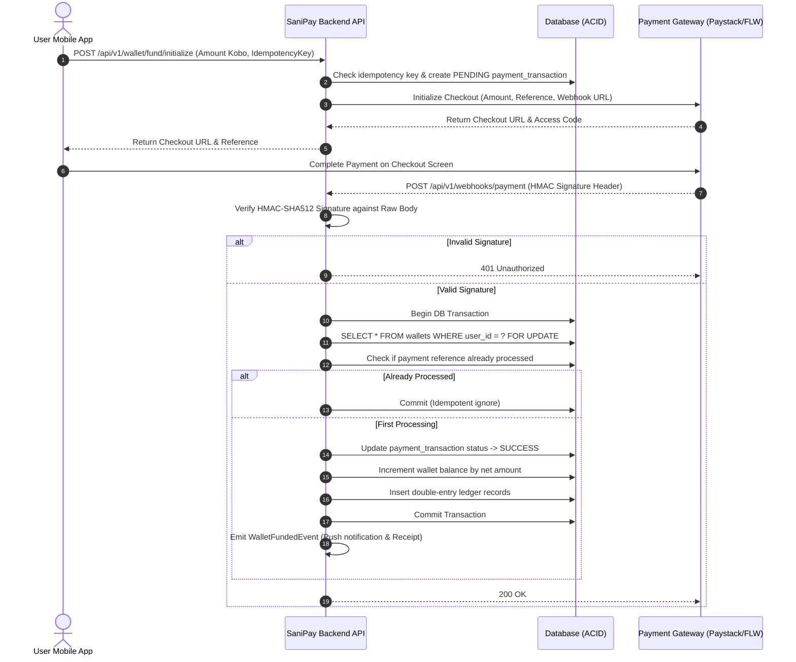

# SaniPay — Nigerian VTU & Digital Services Platform
## Phase 2: System Architecture Document

---

### Document Overview
- **Project Name:** SaniPay
- **Phase:** Phase 2 — System Architecture
- **Version:** 1.0.0
- **Status:** Complete — Ready for Review

---

## 1. Architectural Principles & High-Level Topology

SaniPay is designed using **Clean Architecture (Hexagonal / Ports and Adapters)** principles. This guarantees:
1. **Independence of Frameworks:** The core financial and VTU business logic does not depend on Express, Fastify, or any third-party library.
2. **Pluggable External Providers (Zero Vendor Lock-in):** VTU aggregators (VTpass, ClubKonnect) and payment gateways (Paystack, Flutterwave) are implemented strictly as swappable infrastructure adapters.
3. **Strict Financial Isolation:** The ledger and wallet engine execute in isolated, atomic transaction boundaries using row-level locking.
4. **Security by Design:** Client applications (Flutter Android/iOS) have zero access to private keys or provider secrets.



---

## 2. Pluggable Provider Abstraction Layer (Ports & Adapters)

To prevent coupling to any specific Nigerian vendor, all external services implement standardized TypeScript interfaces.

### 2.1 Payment Gateway Port (`IPaymentGateway`)
```typescript
export interface PaymentInitRequest {
  readonly reference: string;
  readonly amountKobo: bigint;
  readonly email: string;
  readonly customerName: string;
  readonly metadata?: Record<string, unknown>;
}

export interface PaymentInitResponse {
  readonly reference: string;
  readonly checkoutUrl: string;
  readonly accessCode?: string;
}

export interface PaymentVerificationResult {
  readonly reference: string;
  readonly amountKobo: bigint;
  readonly status: 'SUCCESS' | 'FAILED' | 'PENDING';
  readonly channel: string; // 'card' | 'bank_transfer' | 'ussd'
  readonly paidAt?: Date;
  readonly rawProviderPayload: Record<string, unknown>;
}

export interface IPaymentGateway {
  readonly providerName: string;
  initializePayment(request: PaymentInitRequest): Promise<PaymentInitResponse>;
  verifyPayment(reference: string): Promise<PaymentVerificationResult>;
  verifyWebhookSignature(rawBody: string | Buffer, signature: string): boolean;
  parseWebhookEvent(rawBody: string | Buffer): { event: string; data: Record<string, unknown> };
}
```

### 2.2 VTU Aggregator Port (`IVTUProvider`)
```typescript
export type TelecomNetwork = 'MTN' | 'AIRTEL' | 'GLO' | '9MOBILE';
export type MeterType = 'PREPAID' | 'POSTPAID';

export interface AirtimeOrderRequest {
  readonly transactionReference: string;
  readonly network: TelecomNetwork;
  readonly phone: string;
  readonly amountKobo: bigint;
}

export interface DataOrderRequest {
  readonly transactionReference: string;
  readonly network: TelecomNetwork;
  readonly phone: string;
  readonly planCode: string; // Aggregator plan code
  readonly amountKobo: bigint;
}

export interface MeterVerificationRequest {
  readonly providerCode: string; // e.g. 'ikeja-electric', 'eko-electric'
  readonly meterNumber: string;
  readonly meterType: MeterType;
}

export interface MeterDetails {
  readonly meterNumber: string;
  readonly customerName: string;
  readonly address: string;
  readonly providerCode: string;
  readonly isValid: boolean;
}

export interface ElectricityOrderRequest {
  readonly transactionReference: string;
  readonly providerCode: string;
  readonly meterNumber: string;
  readonly meterType: MeterType;
  readonly amountKobo: bigint;
  readonly phone: string;
}

export interface SmartcardVerificationRequest {
  readonly providerCode: string; // 'dstv' | 'gotv' | 'startimes'
  readonly smartcardNumber: string;
}

export interface SmartcardDetails {
  readonly smartcardNumber: string;
  readonly customerName: string;
  readonly currentBouquet?: string;
  readonly dueDate?: string;
  readonly isValid: boolean;
}

export interface CableOrderRequest {
  readonly transactionReference: string;
  readonly providerCode: string;
  readonly smartcardNumber: string;
  readonly packageCode: string;
  readonly amountKobo: bigint;
  readonly phone: string;
}

export interface ProviderExecutionResult {
  readonly providerReference: string;
  readonly status: 'SUCCESS' | 'FAILED' | 'PENDING';
  readonly token?: string; // For prepaid electricity tokens
  readonly units?: string; // Electricity kWh units
  readonly message: string;
  readonly rawResponse: Record<string, unknown>;
}

export interface IVTUProvider {
  readonly providerName: string;
  purchaseAirtime(order: AirtimeOrderRequest): Promise<ProviderExecutionResult>;
  purchaseData(order: DataOrderRequest): Promise<ProviderExecutionResult>;
  verifyMeter(request: MeterVerificationRequest): Promise<MeterDetails>;
  purchaseElectricity(order: ElectricityOrderRequest): Promise<ProviderExecutionResult>;
  verifySmartcard(request: SmartcardVerificationRequest): Promise<SmartcardDetails>;
  purchaseCableTV(order: CableOrderRequest): Promise<ProviderExecutionResult>;
  queryTransactionStatus(providerReference: string): Promise<ProviderExecutionResult>;
}
```

---

## 3. Financial Architecture & Double-Entry Ledger Invariant

### 3.1 Money Representation
All financial amounts are stored as **unsigned 64-bit integers** (`BIGINT` in SQL, `bigint` in TypeScript) representing **Kobo** (`1 NGN = 100 Kobo`).
- ₦100.00 = `10000` Kobo
- ₦1,500.50 = `150050` Kobo
- Division or floating-point arithmetic is prohibited in ledger balance operations.

### 3.2 Double-Entry Invariant
Every financial event produces at least two corresponding ledger entries:
$$\sum \text{Debits} = \sum \text{Credits}$$

### 3.3 Core Ledger Accounts
1. `ASSET:GATEWAY_CLEARING` (Funds receivable from payment gateways)
2. `LIABILITY:USER_WALLET:{userId}` (Obligation owed to the user)
3. `LIABILITY:USER_REFERRAL_WALLET:{userId}` (Accrued referral rewards)
4. `EXPENSE:PROVIDER_COST` (Cost paid to telecom / VTU aggregators)
5. `REVENUE:SERVICE_MARGIN` (SaniPay earned markup or commission)
6. `REVENUE:CONVENIENCE_FEE` (Fees collected on bills)

---

## 4. Financial Transaction Workflows

### 4.1 Wallet Funding Flow (Paystack / Webhook Integration)



### 4.2 VTU Purchase & Instant Refund Flow (Airtime, Data, Bills)

```mermaid
sequenceDiagram
    autonumber
    actor User as User Mobile App
    participant API as SaniPay Backend API
    participant DB as Database (ACID)
    participant VTU as VTU Aggregator API

    User->>API: POST /api/v1/vtu/purchase (Service, Target, Amount, PIN, IdempotencyKey)
    API->>API: Validate Input & Verify Transaction PIN Hash
    API->>DB: Begin DB Transaction
    API->>DB: SELECT * FROM wallets WHERE user_id = ? FOR UPDATE
    alt Insufficient Balance
        API->>DB: Rollback
        API-->>User: 400 Bad Request (Insufficient Wallet Balance)
    else Sufficient Balance
        API->>DB: Deduct Amount from Wallet Balance
        API->>DB: Create transaction record (status = 'PROCESSING')
        API->>DB: Commit Transaction (Funds securely locked)
        
        API->>VTU: Call Provider Purchase API (Order Details)
        alt Provider Returns SUCCESS
            API->>DB: Update transaction status = 'SUCCESS', save token/units
            API-->>User: 200 OK (Receipt with token/success details)
        else Provider Returns PENDING / TIMEOUT
            API->>DB: Keep status = 'PROCESSING', enqueue background status-checker
            API-->>User: 202 Accepted (Transaction Processing; notification will follow)
        else Provider Returns DEFINITIVE FAILURE
            API->>DB: Begin Refund Transaction (ACID)
            API->>DB: SELECT * FROM wallets WHERE user_id = ? FOR UPDATE
            API->>DB: Credit Amount back to Wallet Balance
            API->>DB: Update transaction status = 'REFUNDED' / 'FAILED'
            API->>DB: Insert Refund Ledger Entry
            API->>DB: Commit Refund
            API-->>User: 400 Bad Request (Provider Failed; Funds automatically refunded)
        end
    end
```

---

## 5. Security & Defense-in-Depth Architecture

| Threat Vector | Defense Mechanism |
| :--- | :--- |
| **Double Spending / Race Conditions** | Pessimistic Row-Level Locking (`SELECT ... FOR UPDATE`), unique composite index on idempotency keys. |
| **Credential & Key Exposure** | Zero client secrets. Private API tokens and DB URLs reside exclusively in server `.env`. Flutter app only receives temporary JWTs. |
| **Brute-Force & PIN Guessing** | Redis/Memory rate-limiting: 5 attempts per 15 minutes. Automatic account/PIN lockout after threshold breach. |
| **Unauthorized Financial Calls** | Mandatory 4-digit Transaction PIN or biometric cryptographic token verification on every debit request. |
| **Fake Webhook Injection** | Strict HMAC-SHA512 raw body verification. IP whitelist verification against known gateway CIDR blocks where supported. |
| **SQL Injection & Data Tampering** | Strict parameterized query abstraction (Prisma/TypeORM), Zod runtime schema validation on all inputs. |
| **Man-in-the-Middle (MitM)** | Enforced TLS 1.3/1.2, HTTP Strict Transport Security (HSTS), and SSL Pinning readiness in the mobile Dio client. |

---

## 6. Mobile Application Architecture (Flutter + Dart)

The Flutter mobile application follows **Clean Feature-Driven Architecture**:

```
mobile/lib/
├── core/
│   ├── config/             # Configurable App branding (SaniPay), API URLs
│   ├── constants/          # Colors, Spacings, Asset paths
│   ├── errors/             # Failure models, exception translation
│   ├── network/            # Dio HTTP client, JWT Interceptor, Error Interceptor
│   ├── storage/            # FlutterSecureStorage (Keystore / Keychain)
│   ├── theme/              # Material 3 Light and Dark color schemes
│   └── utils/              # Kobo-to-Naira formatters, Phone number normalizers
│
└── features/               # Self-contained feature modules
    ├── auth/               # Presentation (Screens, Widgets), Domain, Data
    ├── dashboard/          # Navigation shell, Bottom Nav, Home Overview
    ├── wallet/             # Wallet Card, Top-up modal, Bank Transfer details
    ├── airtime/            # Telecom selector, Contact picker, Purchase modal
    ├── data/               # Dynamic Plan selector, Tabbed categories
    ├── electricity/        # DisCo list, Meter validator, Token receipt
    ├── cable/              # Smartcard validator, Bouquet picker
    ├── transactions/       # Paginated history, Receipt details, Share/Export
    ├── referral/           # Referral code card, Earnings summary
    ├── profile/            # Security settings, PIN change, Biometrics toggle
    └── support/            # Ticket creation, In-app messaging
```

---

## 7. Standard API Response Contract

All backend endpoints adhere to a standardized JSON response envelope:

```typescript
// Success Response
interface ApiResponse<T> {
  success: true;
  message: string;
  data: T;
  meta?: {
    page?: number;
    limit?: number;
    totalCount?: number;
    totalPages?: number;
  };
}

// Error Response
interface ApiErrorResponse {
  success: false;
  message: string;
  errorCode: string; // e.g. 'INSUFFICIENT_BALANCE', 'INVALID_TRANSACTION_PIN', 'RATE_LIMIT_EXCEEDED'
  errors?: Array<{ field: string; message: string }>;
}
```

---

## 8. Summary of Completed Architectural Decisions
1. **Architecture Style:** Hexagonal / Clean Architecture with Pluggable Adapters.
2. **Ledger Model:** Double-entry bookkeeping with strict Kobo integer representation.
3. **Concurrency Control:** Atomic transactions with pessimistic row-level locks and idempotency keys.
4. **State Machine:** Deterministic transaction transitions with automated instant refund capability.
5. **Mobile Pattern:** Feature-driven Flutter architecture with Material 3 and BLoC state management.
