# SaniPay — Database Design & Migrations Specification
## Phase 3: PostgreSQL Schema & Prisma ORM

---

### Document Overview
- **Project Name:** SaniPay
- **Phase:** Phase 3 — Database Design and Migrations
- **Engine:** PostgreSQL 16
- **ORM:** Prisma ORM
- **Financial Rule:** All balances, transactions, commissions, fees, and prices are strictly stored as unsigned 64-bit integers in **Kobo** (`1 NGN = 100 Kobo`). Zero floating-point representation.

---

## 1. Relational Entity Overview

The schema is divided into 7 functional domains comprising 25 normalized models:

```mermaid
erDiagram
    users ||--o| user_profiles : "1-to-1"
    users ||--o| wallets : "1-to-1"
    users ||--o{ refresh_tokens : "1-to-many"
    users ||--o{ transactions : "1-to-many"
    users ||--o{ payment_transactions : "1-to-many"
    users ||--o{ referrals : "refers"
    users ||--o{ referral_rewards : "receives"
    users ||--o{ notifications : "receives"
    users ||--o{ support_tickets : "submits"

    wallets ||--o{ wallet_transactions : "ledger entries"
    transactions ||--o{ wallet_transactions : "associates"
    transactions ||--o{ transaction_items : "contains"
    transactions ||--o| payment_transactions : "funds"
    transactions ||--o| airtime_transactions : "tops up"
    transactions ||--o| data_transactions : "buys bundle"
    transactions ||--o| electricity_transactions : "pays utility"
    transactions ||--o| cable_transactions : "subscribes TV"
    transactions ||--o| refunds : "refunds"
    transactions ||--o{ provider_transactions : "logs raw call"

    networks ||--o{ data_plans : "offers"
    networks ||--o{ airtime_transactions : "routes"
    networks ||--o{ data_transactions : "routes"
    data_plans ||--o{ data_transactions : "references"
    electricity_providers ||--o{ electricity_transactions : "bills"
    cable_providers ||--o{ cable_transactions : "bills"
    support_tickets ||--o{ support_messages : "contains"
```



---

## 2. Table-by-Table Technical Specifications

### 2.1 Identity & Access Control
| Table Name | Primary Key | Key Foreign Keys & Indexes | Purpose |
| :--- | :--- | :--- | :--- |
| `users` | `id (UUID)` | `UNIQUE(email)`, `UNIQUE(phone)`, `UNIQUE(referral_code)`, `referred_by_id -> users(id)` | Core user credential, KYC state, 4-digit PIN hash, login rate-limiting lockout. |
| `user_profiles` | `id (UUID)` | `UNIQUE(user_id) -> users(id)` | Full legal name, BVN/NIN verification flags, avatar, location. |
| `refresh_tokens` | `id (UUID)` | `INDEX(user_id)`, `UNIQUE(token_hash)` | Rotating cryptographically secure refresh tokens with revocation support. |
| `admin_users` | `id (UUID)` | `UNIQUE(email)` | Administrative staff accounts with granular roles (`SUPPORT`, `FINANCE_ADMIN`, `SUPER_ADMIN`). |

### 2.2 Financial Ledger & Wallets
| Table Name | Primary Key | Key Foreign Keys & Indexes | Purpose |
| :--- | :--- | :--- | :--- |
| `wallets` | `id (UUID)` | `UNIQUE(user_id) -> users(id)` | Core available and ledger balances in Kobo, lock status, and optimistic lock version. |
| `wallet_transactions` | `id (UUID)` | `INDEX(wallet_id, created_at)`, `INDEX(transaction_id)` | Immutable double-entry ledger records tracking before/after balances, debit/credit types. |
| `refunds` | `id (UUID)` | `UNIQUE(transaction_id) -> transactions(id)`, `INDEX(user_id)` | Formal refund entries documenting amount in Kobo, reason, status, and auditor ID. |

### 2.3 Transactions & Services
| Table Name | Primary Key | Key Foreign Keys & Indexes | Purpose |
| :--- | :--- | :--- | :--- |
| `transactions` | `id (UUID)` | `UNIQUE(reference)`, `UNIQUE(idempotency_key)`, `INDEX(user_id, created_at)`, `INDEX(status)` | Master transaction coordinator tracking lifecycle status, net amount, fee, and provider reference. |
| `transaction_items` | `id (UUID)` | `INDEX(transaction_id)` | Itemized breakdown of multiple purchases or fees within a transaction. |
| `payment_transactions` | `id (UUID)` | `UNIQUE(transaction_id)`, `UNIQUE(gateway_reference)`, `INDEX(user_id)` | Gateway funding events (Paystack/Flutterwave), webhook raw payload, and channel metadata. |
| `airtime_transactions` | `id (UUID)` | `UNIQUE(transaction_id)`, `INDEX(recipient_phone)`, `network_id -> networks(id)` | Airtime delivery records, network code, recipient phone, and applied discount in Kobo. |
| `data_transactions` | `id (UUID)` | `UNIQUE(transaction_id)`, `INDEX(recipient_phone)`, `plan_id -> data_plans(id)` | Mobile data bundle delivery records, plan name, data volume, and recipient phone. |
| `electricity_transactions` | `id (UUID)` | `UNIQUE(transaction_id)`, `INDEX(meter_number)`, `provider_id -> electricity_providers(id)` | Meter number, validated customer name, DisCo provider, 20-digit token, and kWh units. |
| `cable_transactions` | `id (UUID)` | `UNIQUE(transaction_id)`, `INDEX(smartcard_number)`, `provider_id -> cable_providers(id)` | Smartcard/IUC number, customer name, package code, renewal duration in months. |

### 2.4 Catalogs & Providers
| Table Name | Primary Key | Key Foreign Keys & Indexes | Purpose |
| :--- | :--- | :--- | :--- |
| `networks` | `id (UUID)` | `UNIQUE(code)` | Nigerian telecom operators (MTN, Airtel, Glo, 9mobile) with discount basis points (`airtime_discount_bps`). |
| `data_plans` | `id (UUID)` | `UNIQUE(network_id, plan_code)`, `INDEX(network_id, is_active)` | Dynamic data plans catalog with wholesale cost and retail selling prices in Kobo. |
| `electricity_providers`| `id (UUID)` | `UNIQUE(code)` | DisCo catalog (IKEDC, EKEDC, AEDC, etc.) with configurable convenience fees. |
| `cable_providers` | `id (UUID)` | `UNIQUE(code)` | Cable TV catalog (DStv, GOtv, StarTimes, Showmax) with convenience fees. |
| `provider_transactions`| `id (UUID)` | `INDEX(transaction_id)`, `INDEX(provider_reference)` | Audit log of raw HTTP requests and responses sent to VTU/Payment vendors. |

### 2.5 Engagement, Support & System
| Table Name | Primary Key | Key Foreign Keys & Indexes | Purpose |
| :--- | :--- | :--- | :--- |
| `referrals` | `id (UUID)` | `UNIQUE(referred_user_id)`, `INDEX(referrer_id)` | Tracking who referred whom and qualification status. |
| `referral_rewards` | `id (UUID)` | `INDEX(user_id, is_paid)` | Accrued referral bonuses in Kobo and payout transaction links. |
| `notifications` | `id (UUID)` | `INDEX(user_id, is_read)` | User notification inbox with read/unread tracking and metadata. |
| `support_tickets` | `id (UUID)` | `UNIQUE(ticket_number)`, `INDEX(user_id, status)` | Support inquiries categorized by service type with priority indicators. |
| `support_messages` | `id (UUID)` | `INDEX(ticket_id, created_at)` | Threaded communication between customer and administrative support. |
| `audit_logs` | `id (UUID)` | `INDEX(actor_id)`, `INDEX(action)`, `INDEX(created_at)` | Immutable administrative actions, price adjustments, and system events. |
| `system_settings` | `id (UUID)` | `UNIQUE(key)` | Dynamic key-value configuration flags (margins, thresholds, maintenance toggle). |

---

## 3. Financial Invariants & Concurrency Guarantees

### 3.1 Strict Integer Kobo Arithmetic
- Currency unit: **Kobo** (1 Nigerian Naira = 100 Kobo).
- Stored as: `BigInt` (Prisma) / `BIGINT` (PostgreSQL).
- Example: ₦2,500.00 is stored as `250000n`.
- Floating-point types (`FLOAT`, `DOUBLE`, `REAL`) are strictly excluded from financial columns.

### 3.2 Double-Entry Ledger Consistency
Every transaction affecting balances must insert into `wallet_transactions`:
- Balance mutation equation:
$$\text{balanceAfterKobo} = \text{balanceBeforeKobo} \pm \text{amountKobo}$$
- Verification constraint: At all times, the wallet's `balanceKobo` must equal the latest `balanceAfterKobo` of its latest ledger entry.

### 3.3 Concurrency Control & Double-Spending Prevention
All debit and credit operations execute inside atomic database transactions:
```sql
BEGIN;
-- Pessimistic row-level lock ensures no two transactions can read or deduct simultaneously
SELECT id, balance_kobo, is_locked FROM wallets WHERE user_id = $1 FOR UPDATE;

-- Validate sufficient funds and lock state
-- Deduct amount and update wallet
UPDATE wallets SET balance_kobo = balance_kobo - $2, updated_at = NOW() WHERE id = $3;

-- Write immutable audit ledger entry
INSERT INTO wallet_transactions (id, wallet_id, transaction_id, type, amount_kobo, balance_before_kobo, balance_after_kobo, description, created_at)
VALUES ($4, $3, $5, 'DEBIT', $2, $6, $6 - $2, $7, NOW());

COMMIT;
```

---

## 4. Master Seed Data Summary

The seed script (`backend/prisma/seed.ts`) pre-populates:
1. **Networks:** MTN (2.5% discount), Airtel (2.0% discount), Glo (3.0% discount), 9mobile (3.0% discount).
2. **Data Plans:** SME, Corporate Gifting, and Direct Data plans with wholesale and retail prices in Kobo.
3. **DisCos:** All major Nigerian DisCos (IKEDC, EKEDC, AEDC, IBEDC, PHED, KEDCO, JED, EEDC).
4. **Cable TV:** DStv, GOtv, StarTimes, Showmax with standard ₦100 convenience fee.
5. **System Settings:** Default referral bonuses, minimum qualification thresholds, and provider routing flags.
